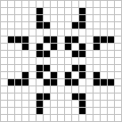
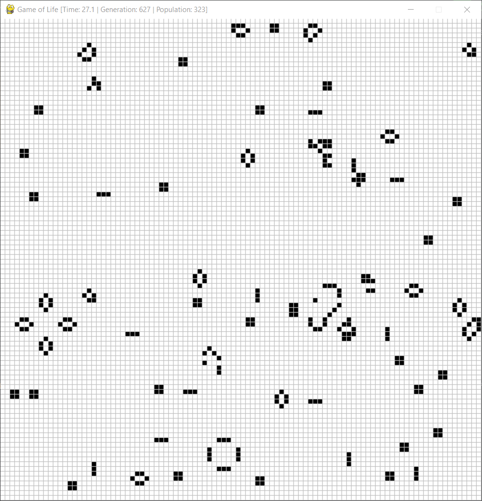
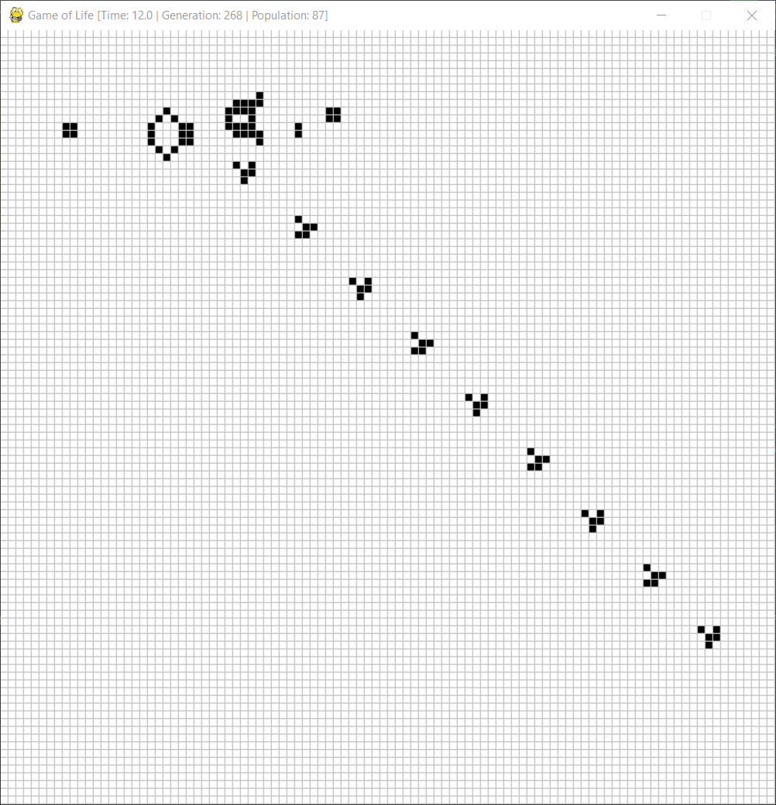

# Conway's Game of Life


A Python implementation of Conway's Game of Life

## What is Game of Life?
Game of Life is a cellular automata devised by British mathematician John Horton Conway (1937 - 2020). Evolution is determined by initial state only and its purpose is to observe how it evolves.

## How does Game of Life work?
In theory, Game of Life is an infinite two-dimensional grid of cells, with only two possible states: alive, dead. Each cell has 8 neighbours (including diagonally adjacent cells). At each iteration, the following occur:
- Any live cell with fewer than two live neighbour cells dies
- Any live cell with two or three neighbour cells live to the next generation
- Any live cell with more than three neighbour cells dies
- Any dead cell with exactly three neighbour cells become a live cell

## Demo





## Using this program

### Patterns
My Game of Life implementation comes with a few patterns you may observe.

#### Glider


#### Lightweight spaceship (LWWS)


<i>Source images from Wikipedia (Public domain)</i>

You may add your own patterns if you wish, as a Python module in the `./patterns` directory. Feel free to create a pull request for this repository.

### Command-line usage
`usage: main.py [-h] [-c CELLSIZE] [-g GRIDSIZE] [-d DELAY] [-p PATTERN] [-x XOFFSET] [-y YOFFSET]`

```
options:
  -h, --help            show this help message and exit
  -c CELLSIZE, --cellsize CELLSIZE
                        Size of each cell (pixels)
  -g GRIDSIZE, --gridsize GRIDSIZE
                        Size of the simulation (cells)
  -d DELAY, --delay DELAY
                        Animation delay between each generation (milliseconds)
  -p PATTERN, --pattern PATTERN
                        Pattern to use
  -x XOFFSET, --xoffset XOFFSET
                        Pattern offset on x-axis
  -y YOFFSET, --yoffset YOFFSET
                        Pattern offset on y-axis
```

A "random" pattern is hardcoded into this program, which you can observe with `random` as the parameter for `-p PATTERN`. This sets 20% of the grid as alive.